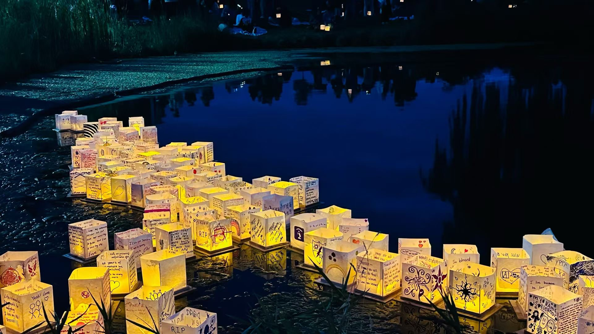
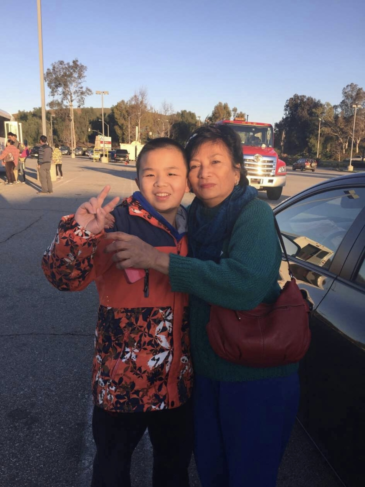
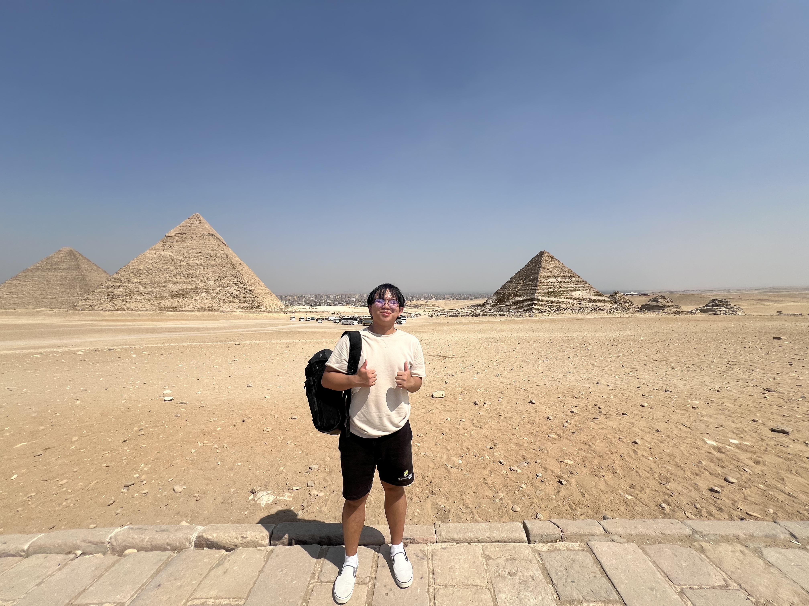
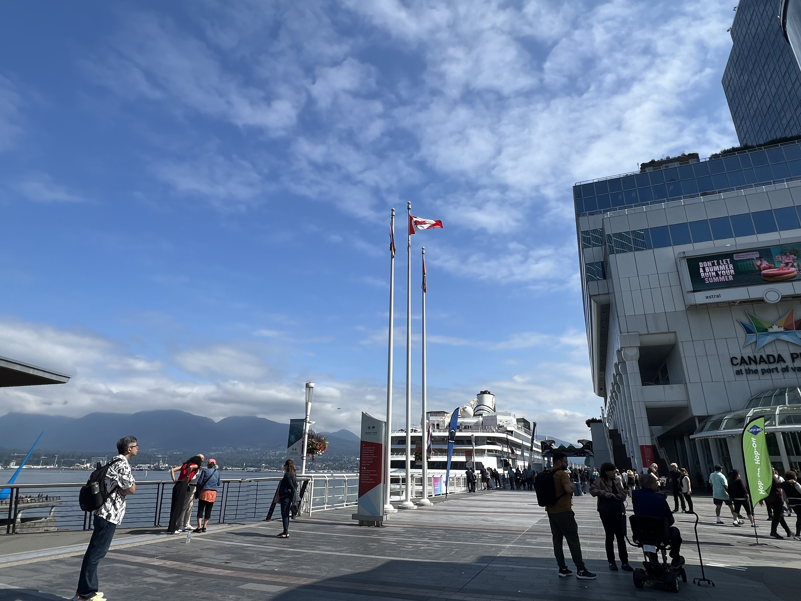
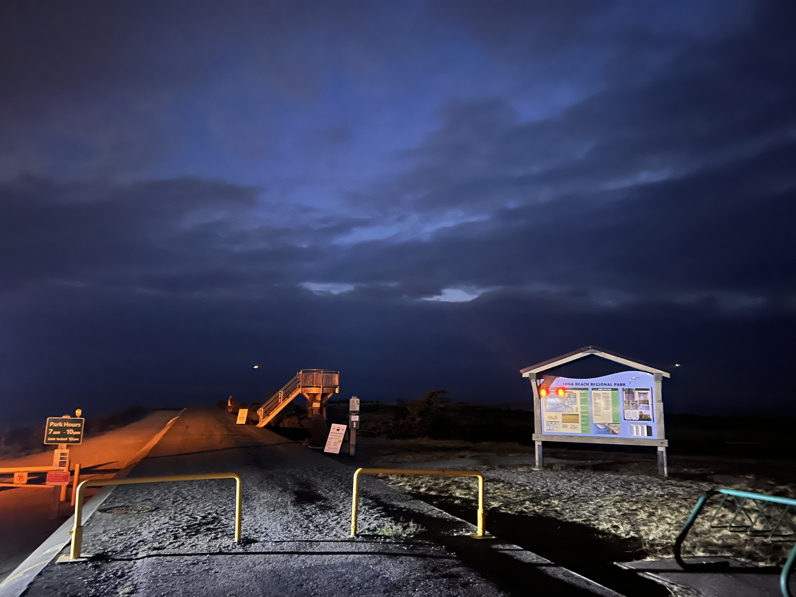
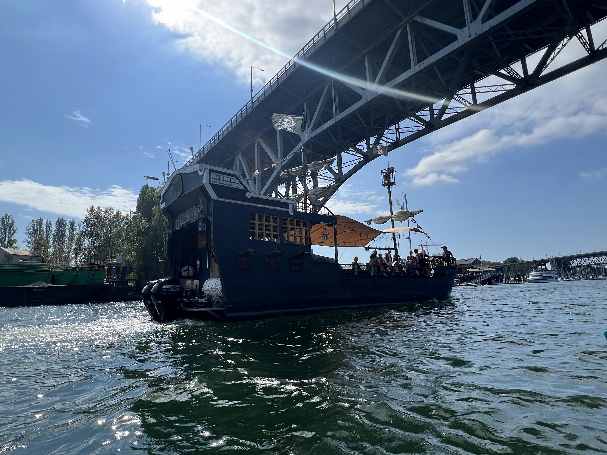
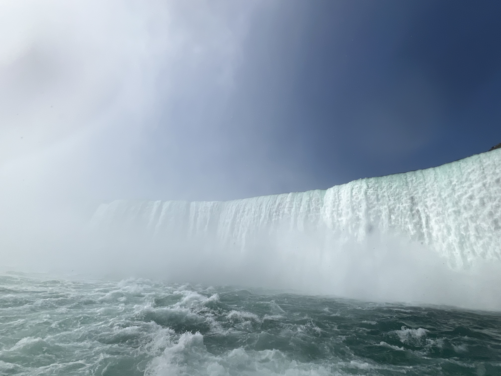
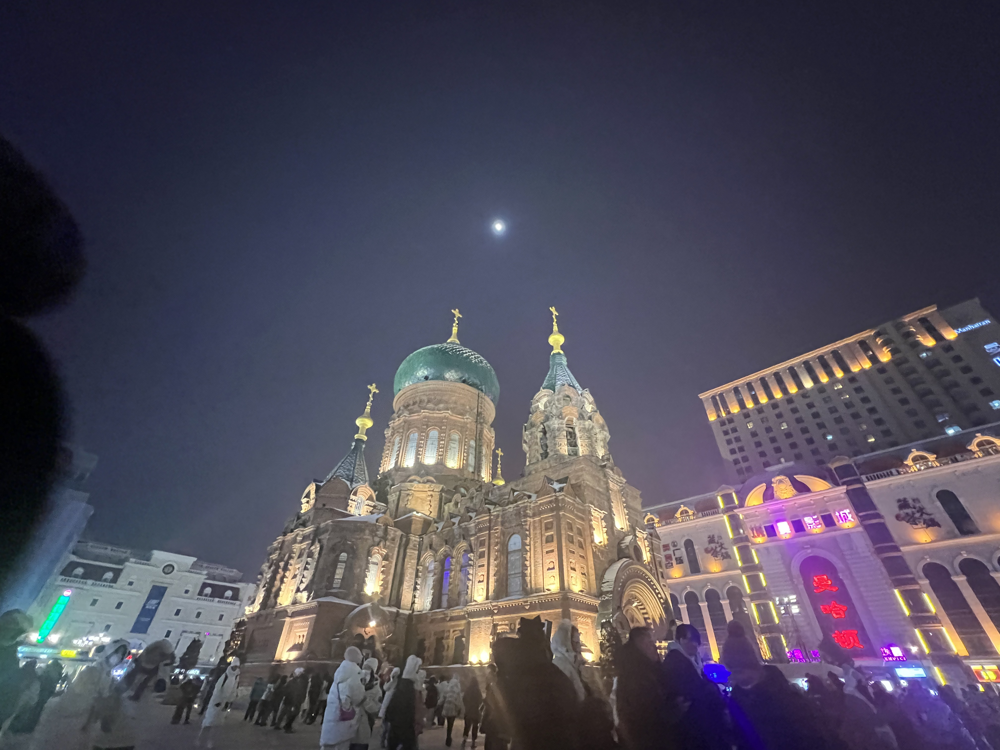

# 🌍 Journey

> “Collect moments, not things.”  
> Snapshots from places that changed how I think, breathe, and see the world.

---

  <h2>🇺🇸 Madison, USA</h2>
  

    

      
      
Madison — Lake Monona’s quiet glow.

    

    

      
      
Madison — Where the wind smells like water.

    

  

  <h2>🇺🇸 California, USA</h2>
  

    

      
      
California — The golden haze that never ends.

    

  

  <h2>🇭🇰 Hong Kong</h2>
  

    

      
      
Hong Kong — Hills meet glass and sea.

    

    

      
      
Hong Kong — Neon, rain, and endless motion.

    

  

  <h2>🇪🇬 Egypt</h2>
  

    

      
      
Egypt — Sand remembers better than people do.

    

  

  <h2>🇨🇦 Canada</h2>
  

    

    

    

    

    

    

    

  

  
Canada — Silence that hums like music.

  <h2>🇨🇳 Harbin, China</h2>
  

    

    

    

  

  
Harbin — Frozen light, warm laughter.

